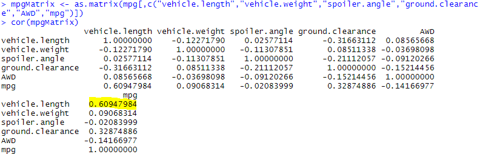
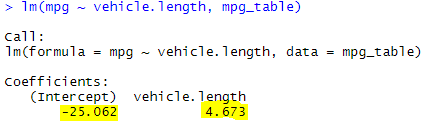
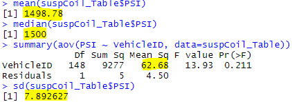
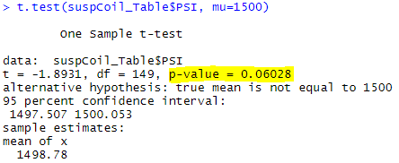

# Statistics-and-R
Apply R and statistics &amp; hypothesis testing to analyze a series of datasets from the automotive industry.

•	Load, clean up, and reshape datasets using tidyverse in R. 
•	Visualize datasets with basic plots such as line, bar, and scatter plots using ggplot2. 
•	Generate and interpret more complex plots such as boxplots and heatmaps using ggplot2. 
•	Plot and identify distribution characteristics of a given dataset. 
•	Formulate null and alternative hypothesis tests for a given data problem. 
•	Implement and evaluate simple linear regression and multiple linear regression models for a given dataset. 
•	Implement and evaluate one-sample t-Tests, two-sample t-Tests, and analysis of variance (ANOVA) models for a given dataset. 
•	Implement and evaluate a chi-squared test for a given dataset. 
•	Identify key characteristics of A/B and A/A testing. 
•	Determine the most appropriate statistical test for a given hypothesis and dataset.

## Challenge 15 
#### (The Analysis is in MechaCarWriteUp.txt) 
1. MPG Regression 
• Which variables/coefficients provided a non-random amount of variance to the mpg values in the dataset? 
  
• Is the slope of the linear model considered to be zero? Why or why not? 
  
• Does this linear model predict mpg of MechaCar prototypes effectively? Why or why not?

2. Suspension Coil Summary 
• summary statistics table:   
  
• The design specifications for the MechaCar suspension coils dictate that the variance of the suspension coils must not exceed 100 pounds per inch. Does the current manufacturing data meet this design specification? Why or why not?

3. Suspension Coil T-Test 
• Determine if the suspension coil’s pound-per-inch results are statistically different from the mean population results of 1,500 pounds per inch. Provide a small writeup of your interpretation and findings for the t-test results.
  

4. Design Your Own Study 
• Think critically about what metrics you would think would be of interest to a consumer. 
• Determine what question we would ask, what the null and alternative hypothesis would be to answer that question, and what statistical test could be used to test this hypothesis. 
• Knowing what test should be used, what data should be collected? 
